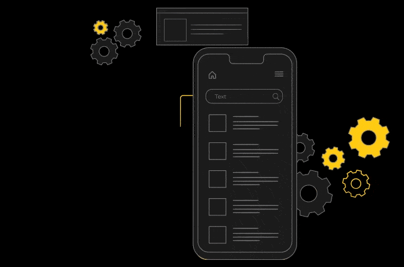

# Hi, I am Ramith Gunawardana👋

<h3>I am a passionate Mobile Developer from Sri Lanka.</h3>

## Languages and Tools:

  
  
  
  
  
  
  
  
  
  
  
  
  
  
  
  
  
  
  
  
  
  
  
  
  
  
  
  
  
  
  
  
  
  
  
  
  
  
  
  
  
  
  
  
  
  
  
  
  
  
  
  
  
  
  
  
  
  
  
  
  
  
  

## Connect with me:

  
  

 

  

^_^
